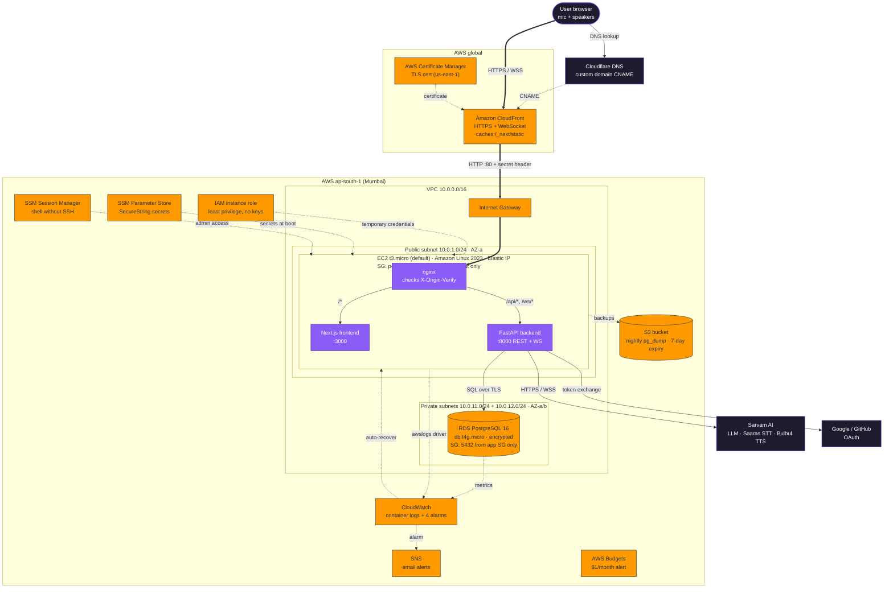
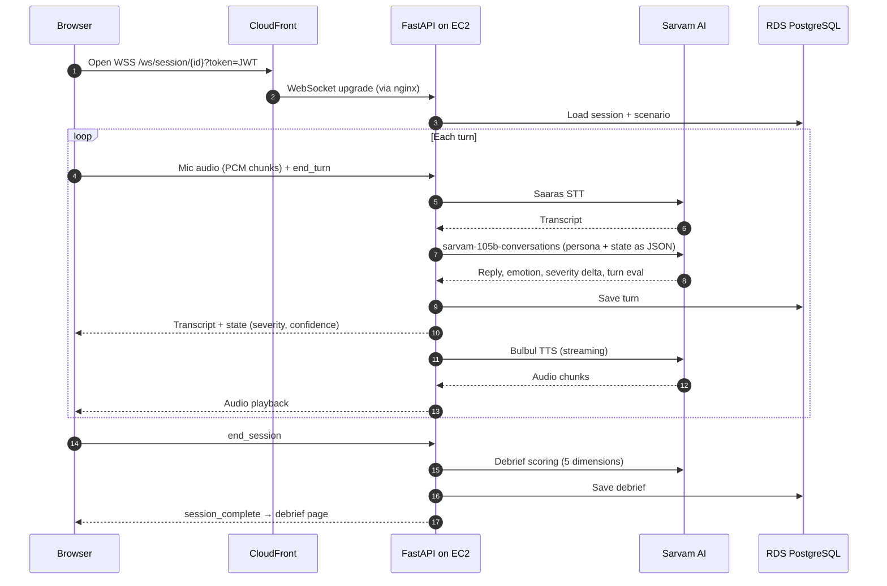

# Redline on AWS: architecture

```mermaid
flowchart TB
    user(["User browser<br/>mic + speakers"])
    cf_dns["Cloudflare DNS<br/>custom domain CNAME"]
    sarvam["Sarvam AI<br/>LLM · Saaras STT · Bulbul TTS"]
    oauth["Google / GitHub<br/>OAuth"]

    subgraph global["AWS global"]
        cdn["Amazon CloudFront<br/>HTTPS + WebSocket<br/>caches /_next/static"]
        acm["AWS Certificate Manager<br/>TLS cert (us-east-1)"]
    end

    subgraph region["AWS ap-south-1 (Mumbai)"]
        subgraph vpc["VPC 10.0.0.0/16"]
            igw["Internet Gateway"]
            subgraph pub["Public subnet 10.0.1.0/24 · AZ-a"]
                subgraph ec2["EC2 t3.micro (default) · Amazon Linux 2023 · Elastic IP<br/>SG: port 80 from CloudFront prefix list only"]
                    nginx["nginx<br/>checks X-Origin-Verify"]
                    fe["Next.js frontend<br/>:3000"]
                    be["FastAPI backend<br/>:8000 REST + WS"]
                end
            end
            subgraph priv["Private subnets 10.0.11.0/24 + 10.0.12.0/24 · AZ-a/b"]
                rds[("RDS PostgreSQL 16<br/>db.t4g.micro · encrypted<br/>SG: 5432 from app SG only")]
            end
        end

        iam["IAM instance role<br/>least privilege, no keys"]
        ssm["SSM Parameter Store<br/>SecureString secrets"]
        sm["SSM Session Manager<br/>shell without SSH"]
        s3[("S3 bucket<br/>nightly pg_dump · 7-day expiry")]
        cw["CloudWatch<br/>container logs + 4 alarms"]
        sns["SNS<br/>email alerts"]
        budget["AWS Budgets<br/>$1/month alert"]
    end

    user -- "DNS lookup" --> cf_dns
    cf_dns -. "CNAME" .-> cdn
    user == "HTTPS / WSS" ==> cdn
    acm -. "certificate" .-> cdn
    cdn == "HTTP :80 + secret header" ==> igw
    igw ==> nginx
    nginx -- "/*" --> fe
    nginx -- "/api/*, /ws/*" --> be
    be -- "SQL over TLS" --> rds
    be -- "HTTPS / WSS" --> sarvam
    be -- "token exchange" --> oauth

    iam -. "temporary credentials" .-> ec2
    ssm -. "secrets at boot" .-> ec2
    sm -. "admin access" .-> ec2
    ec2 -. "backups" .-> s3
    ec2 -. "awslogs driver" .-> cw
    rds -. "metrics" .-> cw
    cw -. "alarm" .-> sns
    cw -. "auto-recover" .-> ec2

    classDef aws fill:#FF9900,stroke:#232F3E,color:#232F3E
    classDef ext fill:#1f1b2e,stroke:#8B5CF6,color:#fff
    classDef app fill:#8B5CF6,stroke:#4c1d95,color:#fff
    class cdn,acm,igw,rds,iam,ssm,sm,s3,cw,sns,budget aws
    class user,cf_dns,sarvam,oauth ext
    class nginx,fe,be app
```

## Voice drill workflow

```mermaid
sequenceDiagram
    autonumber
    participant B as Browser
    participant CF as CloudFront
    participant API as FastAPI on EC2
    participant S as Sarvam AI
    participant DB as RDS PostgreSQL

    B->>CF: Open WSS /ws/session/{id}?token=JWT
    CF->>API: WebSocket upgrade (via nginx)
    API->>DB: Load session + scenario
    loop Each turn
        B->>API: Mic audio (PCM chunks) + end_turn
        API->>S: Saaras STT
        S-->>API: Transcript
        API->>S: sarvam-105b-conversations (persona + state as JSON)
        S-->>API: Reply, emotion, severity delta, turn eval
        API->>DB: Save turn
        API-->>B: Transcript + state (severity, confidence)
        API->>S: Bulbul TTS (streaming)
        S-->>API: Audio chunks
        API-->>B: Audio playback
    end
    B->>API: end_session
    API->>S: Debrief scoring (5 dimensions)
    API->>DB: Save debrief
    API-->>B: session_complete → debrief page
```
